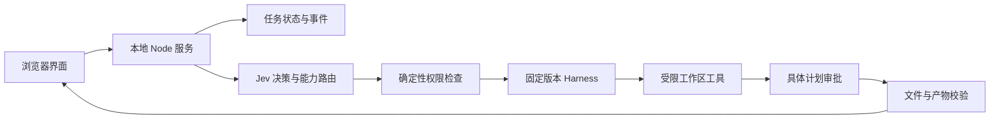

# AI Girlfriend · Companion Agent

面向中文交互的本地 AI 陪伴与任务执行原型，也是持续完善的 Agent 应用开发作品集。

项目把聊天界面、模型运行时、工具调用、具体操作审批、文件产物和取消处理连接起来。重点是让一次任务能被检查：模型提出了什么操作、用户批准了什么、工具实际做了什么、最终文件在哪里。

公开版本提供无需 API Key 的离线演示入口，以及需要自行配置的真实 Harness 运行模式。原人物画像、参考音视频、模型权重、用户会话和私人配置均不随仓库发布；默认形象为项目自制 SVG 占位图。

## 快速开始：离线演示

安装 **Node.js 24 或更新版本**，克隆后运行：

```powershell
git clone https://github.com/regualtoryai-oss/ai-girlfriend.git
cd ai-girlfriend
npm ci --ignore-scripts
npm run demo
```

在浏览器打开终端显示的 `http://127.0.0.1:8793`。若该端口已被占用，可在 PowerShell 中指定端口：

```powershell
$env:COMPANION_PORT = "8794"
npm run demo
```

离线模式无需 Harness、API Key、Python、GPU 或人物素材。聊天和计划来自明确标注的确定性本地替身；任务事件、审批、文件写入和下载是真实本地操作。它不发起网络请求，不读取私人提供商配置，也不开启麦克风或语音服务。

可输入“帮我保存一份学习计划 Markdown 文件”，检查草稿计划并确认，然后下载实际文件。该模式把草稿写入 `data/demo/workspace/demo/<turnId>.md`。它只演示有界任务流程，不证明真实模型已接通或具备相应智能。

## 功能与验证边界

| 功能 | 当前实现 | 验证边界 |
| --- | --- | --- |
| 中文界面与任务卡 | 聊天、状态、审批与文件下载 | 离线演示可复现；输出标明来源 |
| 真实 Agent 运行时 | 固定 DeepSeek Harness `0.1.3-alpha.1` 官方源码 CLI / SDK profile | 需要安装运行时与自行配置模型 |
| 决策与权限 | Jev 候选决策、独立确定性权限检查 | 模型选择不等于执行授权 |
| 工作区文件工具 | 枚举、读取、新建、替换、移动；受限 XLSX 创建 | 相对路径、文件哈希与具体计划审批；以实际产物判断结果 |
| 有界笔记任务 | Markdown 生成、事件、取消与下载 | 工具成功、文件存在及 SHA-256 校验后才发布产物 |
| 任务记录 | 本地持久化状态、事件序号与修订号 | 重启后保留记录；进行中的对话标记 interrupted，不自动续跑 |
| 语音集成 | 按键录音、Whisper 适配、本地中文系统 TTS | 需要用户授权与本地 ASR 环境；识别及声线质量仍待验收 |
| 模型能力路由 | 按配置与已验证能力选择接口，包含多模态适配模块 | 模型列表不代表能力或质量证明；接口仍需逐项真实验证 |

此前本机的真实 Harness 文件任务与文件语音回路验收见 [ACCEPTANCE.md](ACCEPTANCE.md)。这些是历史记录；本轮公开版的离线测试与演示不代表已重新执行收费模型请求、真实麦克风或多模态服务验收。

## 进阶：真实 Harness 模式

当前安装脚本面向 Windows。除 Node.js 24 外，需要 Git、Python 与 Visual Studio C++ Build Tools；`fs-ext` 原生依赖需要本机编译环境。

```powershell
npm ci --ignore-scripts
powershell -File Setup-Harness.ps1
npm start
```

安装脚本下载固定官方 tag `dsh-v0.1.3-alpha.1`，校验 commit `d347e703908d0406b7a7ef80e3a0e594d86b2215`，使用锁定依赖并执行不含模型调用的 SDK 检查。它不会安装全局工具；下载和本机构建仍需要网络与磁盘空间。

打开应用的本地配置页面，填入自己的提供商配置。配置保存在 Git 忽略的 `data/` 下；API Key 不会回显。凭据依赖本机文件权限保护，当前没有加密存储或额外 ACL 保证。

真实模式中的聊天、任务、显式接口测试和部分模型目录发现会向所配置提供商发起请求。配置中转接口时，保存或手动发现可能查询模型列表；生成测试需要单独确认。请按页面显示的实际接口和模式操作。真实运行时不会因为仓库存在历史验收记录而自动获得有效凭据。

## 架构



浏览器负责交互、审批、状态展示与录音。服务端持有提供商配置、任务状态和执行权限。真实模式使用独立 Harness 进程与任务工作区；新的工作区工具通过具体计划审批控制改动，已有笔记工具只写固定文件。用户补充要求或取消时，会撤销尚未执行的旧计划；已经完成的文件操作保留。

应用默认只监听 `127.0.0.1`。停止声音或人物播放与取消后台任务是两个独立操作。更多实现边界见 [server/README.md](server/README.md)、[dsh/alpha1/README.md](dsh/alpha1/README.md) 和 [作品集讲解](docs/PORTFOLIO.md)。

## 测试

```powershell
npm test
```

默认测试使用测试适配器和本地 HTTP fixture，不依赖私人凭据或收费模型请求。Harness 实际加载检查需要先完成固定版本安装：

完整 XLSX / 图像回归需要 Python，并先执行 `python -m pip install -r requirements-files.txt`。可通过 `COMPANION_XLSX_PYTHON` 指定可用解释器；离线演示无需 Python。本次 63 项测试与具体范围见 [验证记录](docs/VERIFICATION.md)。

```powershell
node dsh/alpha1/run-proof.mjs
```

`--live` 会请求真实提供商，不属于普通回归测试。通过单元测试也不等于真实麦克风、语音质量、人物自然度或完整模型效果通过验收。

## 已知限制与后续学习

- 当前是本地原型，缺少面向公网部署的用户体系与运维能力。
- 默认形象是静态占位图；原离线动作研究结果未发布，尚未实现已验收的实时数字人嘴型。
- 按键语音交互已有适配代码，持续监听/VAD 通话与最终自然声线仍需单独实现和验证。
- 任务记录可以持久化；尚未实现重启后自动恢复模型上下文并安全续跑。
- RAG、可管理的长期记忆和系统化效果评测是下一阶段练习，当前不作为已完成功能。
- 编码、图像等适配模块需要逐接口验证；仓库不宣称全部任务类别已完成端到端验收。

学习路线以可审查的小改动推进：先讲清现有调用链，再实现记忆、引用检索、失败恢复和评测，每个阶段补测试、演示与设计说明。练习见 [docs/PORTFOLIO.md](docs/PORTFOLIO.md)。

手写执行循环的配套教学项目：[Agent Learning Lab](https://github.com/regualtoryai-oss/agent-learning-lab)，提供 TypeScript、离线 mock、SQLite 和第一课练习。

## 开源与素材

本仓库新写的项目代码采用 [MIT License](LICENSE)。第三方依赖与上游源码保留各自条款；本许可证不授予原人物画像、参考媒体、模型权重或离线生成素材的发布权。来源和素材范围见 [licenses/ASSET-NOTICE.md](licenses/ASSET-NOTICE.md) 与 [licenses/SOURCES.json](licenses/SOURCES.json)。

欢迎围绕任务可靠性、文件审批、测试和文档提交 Issue 或 Pull Request。反馈请附复现步骤与去除私人信息的日志。
